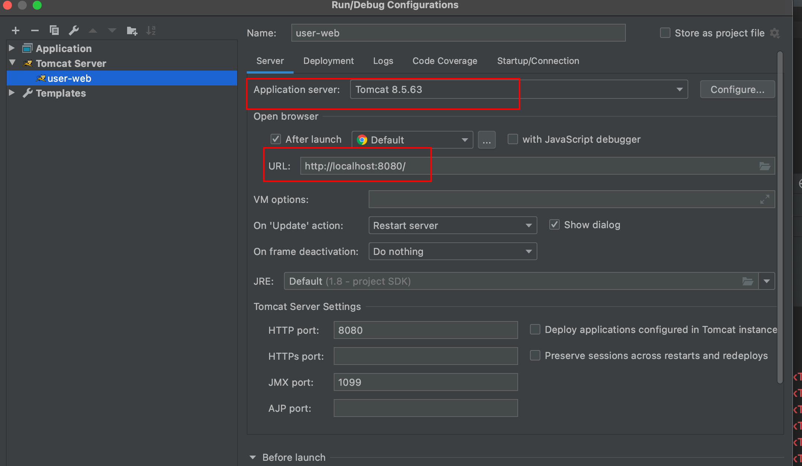
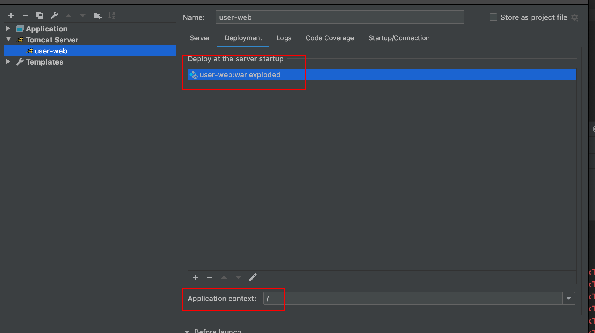

# learn-and-grow

## 调整说明

[**第二次作业说明**](second_refactor_description.md)

[**第三次作业说明**](third_refactor_description.md)

[**第四次作业说明**](fourth_refactor_description.md)

### 启动配置说明

1. JVM 参数配置 -Dtiny.config.path = xxxx.properties 可更换环境配置，暂时只支持 clsspath 下
2. JNDI 的方式说明   
   2.1 并非从 Context 中 lookup 查找对象，因此 user-web/src/main/webapp/META-INF/context.xml 配置的属性无法通过 setter 注入
   
   2.2 参数注入方式可参考 com.arno.grow.user.web.db.jpa.MyDataSourceManager
3. application.properties中的 application.context.type 用于切换 JNDI 和 自研 tiny 依赖注入方式, 未配置该参数时默认自研 tiny
4. application.properties中的 scan.package 用于指定扫描哪些包下的 class 文件，无指定时将不做注入，功能会出问题。
5. 实现入口见 com.arno.learn.grow.tiny.web.context.TinyContextLoaderListener 

### 配置文件

user-web/src/main/resources/application.properties