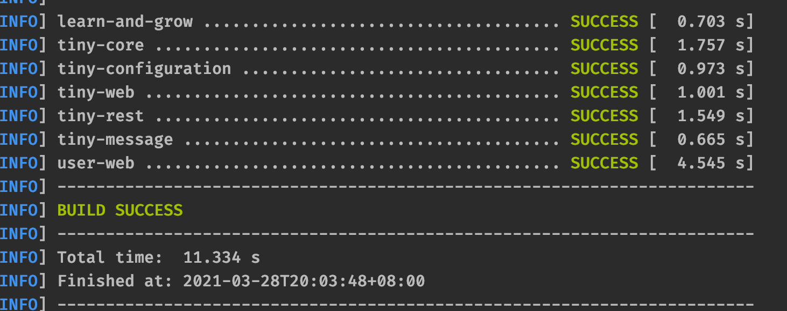
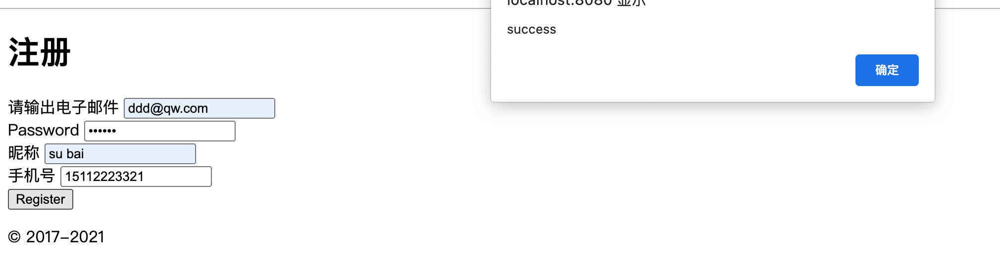
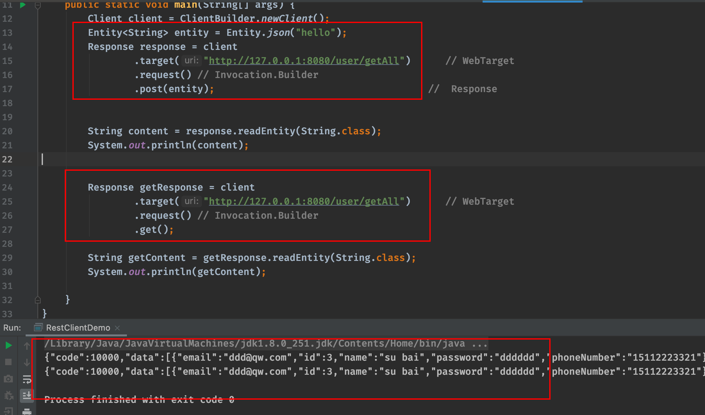

# 2021.03.28 第五次重构说明

## 本次主要目标

1. **修复本程序 org.geektimes.reactive.streams 包下**
2. **继续完善 my-rest-client POST 方法**
3. **（可选）读一下 Servlet 3.0 关于 Servlet 异步**
   1. **AsyncContext**

## 改动点

- 调整主 pom.xml 的依赖顺序
- 去除 tiny-configuration 中的 servlet-api 依赖
- 在 tiny-web 中新增 `ServletMapBasedConfigSource` 类，继承 `MapBasedConfigSource`
- `ServletContextParamConfig` 调整，由原来继承 `MapBasedConfigSource` 改为继承 `ServletMapBasedConfigSource` 

## 完成以下作业

### **作业一：继续完善 POST 方法** 

- 提取抽象类 [**AbstractInvocation**](https://github.com/arno-angelica/learn-and-grow/blob/fifth_refactor/tiny-rest/src/main/java/com/arno/learn/grow/tiny/rest/clinet/AbstractInvocation.java)

- [**HttpGetInvocation**](https://github.com/arno-angelica/learn-and-grow/blob/fifth_refactor/tiny-rest/src/main/java/com/arno/learn/grow/tiny/rest/clinet/HttpGetInvocation.java) 和 [**HttpPostInvocation**](https://github.com/arno-angelica/learn-and-grow/blob/fifth_refactor/tiny-rest/src/main/java/com/arno/learn/grow/tiny/rest/clinet/HttpGetInvocation.java) 继承 `AbstractInvocation`

- 调整 `DefaultRespose` ，去除对 connection 的引用，将响应的流复制一份存储，避免 connection 关闭时无法读取流

  ```java
  private InputStream inputStream;
  public void setInputStreamReader(InputStream inputStream) throws Exception {
    this.inputStream = new ByteArrayInputStream(copyInputStream(inputStream).toByteArray());
  }
  ```

- 测试类为 [**`RestClientDemo`**](https://github.com/arno-angelica/learn-and-grow/blob/fifth_refactor/tiny-rest/src/test/java/com/arno/learn/grow/tiny/rest/demo/RestClientDemo.java)

- 测试方式

  - mvn 打包项目，命令 `mvn clean package -U`

    

  - 打包成功后， 启动 user-web 项目，命令 `java -jar user-web/target/user-web-1.0.0-SNAPSHOT-war-exec.jar `

    - 启动时可能会报以下错误，原因是 pom 中引用了 tomcat 8的插件，而其中有些jar中增加了jdk9特性Module, 此错误不影响程序启动，可忽略

      ```java
      org.apache.tomcat.util.bcel.classfile.ClassFormatException: Invalid byte tag in constant pool: 19
        at org.apache.tomcat.util.bcel.classfile.Constant.readConstant(Constant.java:133)
        at org.apache.tomcat.util.bcel.classfile.ConstantPool.<init>(ConstantPool.java:60)
        at org.apache.tomcat.util.bcel.classfile.ClassParser.readConstantPool(ClassParser.java:209)
        at org.apache.tomcat.util.bcel.classfile.ClassParser.parse(ClassParser.java:119)
        at org.apache.catalina.startup.ContextConfig.processAnnotationsStream(ContextConfig.java:2105)
        at org.apache.catalina.startup.ContextConfig.processAnnotationsJar(ContextConfig.java:1981)
        at org.apache.catalina.startup.ContextConfig.processAnnotationsUrl(ContextConfig.java:1947)
        at org.apache.catalina.startup.ContextConfig.processAnnotations(ContextConfig.java:1932)
        at org.apache.catalina.startup.ContextConfig.webConfig(ContextConfig.java:1326)
        at org.apache.catalina.startup.ContextConfig.configureStart(ContextConfig.java:878)
        at org.apache.catalina.startup.ContextConfig.lifecycleEvent(ContextConfig.java:369)
        at org.apache.catalina.util.LifecycleSupport.fireLifecycleEvent(LifecycleSupport.java:119)
        at org.apache.catalina.util.LifecycleBase.fireLifecycleEvent(LifecycleBase.java:90)
        at org.apache.catalina.core.StandardContext.startInternal(StandardContext.java:5179)
      
      ```

  - 访问`http://localhost:8080/` 随便注册一个用户

    

  - 执行 `RestClientDemo`

  - 控制台输出 `RestClientDemo` 的结果

    

    

### **作业二：修复本程序 reactive.streams 程序**


## 问题

- 


## 后续优化点

